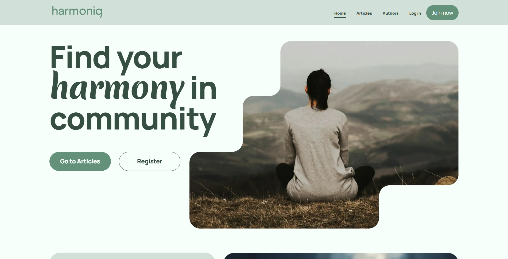

# 🎧 Harmoniq App – Team Project

A modern web application built as a **team project**, focused on music content and user interaction.

## 📌 About the Project

Harmoniq is a team-based web application focused on delivering an interactive user experience around music content.

The project was built using modern frontend technologies and includes dynamic UI components, API integration, and responsive design.

The application allows users to browse content, interact with UI elements, and experience a clean and modern interface.

## 🛠 Tech Stack

- HTML5
- CSS3
- JavaScript (ES6+)
- Vite
- REST API
- Git & GitHub
- Figma

## ✨ Features

- Responsive layout
- Dynamic content rendering
- API integration
- Modal windows
- Interactive UI elements
- Smooth hover and button animations
- Component-based structure
- Team collaboration workflow

## 👩‍💻 My Contribution

This was a **team project**.

I worked on:
- Reviews section (layout and styling)
- UI styling and responsiveness
- Integration into the overall project structure
- Collaboration using Git and GitHub

## 📚 What I Learned

- Working in a team environment
- Managing Git workflow in a group project
- Structuring larger applications
- Integrating UI sections into a shared codebase
- Improving communication and coordination in development

## 🔧 Future Improvements

- Improve UI/UX
- Add animations and transitions
- Optimize performance
- Improve accessibility
- Add additional features

## 👩‍💻 Author

GitHub: https://github.com/darialozovska

## 🚀 Live Demo

https://harmoniq-tau.vercel.app/

## 🔗 Repository

https://github.com/darialozovska/harmoniq-app-team-project

## 📷 Preview

## 📷 Preview

